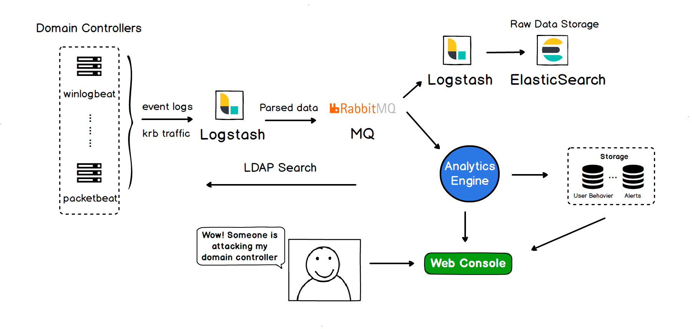

# WatchAD

    

> 基于域攻击流量监测系统的分析与实现

AD收集所有域控上的事件日志和kerberos流量，通过特征匹配、Kerberos协议分析、历史行为、敏感操作和蜜罐账户等方式来检测各种已知与未知威胁，功能覆盖了大部分目前的常见内网域渗透手法。

目前支持的具体检测功能如下：

- **信息探测**：使用SAMR查询敏感用户组、使用SAMR查询敏感用户、蜜罐账户的活动、PsLoggedOn信息收集
- **凭证盗取**：Kerberoasting （流量）、AS-REP Roasting、远程Dump域控密码
- **横向移动**：账户爆破、显式凭据远程登录、目标域控的远程代码执行、未知文件共享名、Kerberos票据加密方式降级（流量）、异常的Kerberos票据请求（流量）
- **权限提升**：ACL修改、MS17-010攻击检测、新增组策略监控、NTLM 中继检测、基于资源的约束委派权限授予检测、攻击打印机服务 SpoolSample、未知权限提升、MS14-068攻击检测（流量）、Kerberos约束委派滥用（流量）
- **权限维持**：AdminSDHolder对象修改、DCShadow攻击检测、DSRM密码重置、组策略委派权限授予检测、Kerberos约束委派权限授予检测、敏感用户组修改、域控新增系统服务、域控新增计划任务、SIDHistory属性修改、万能钥匙-主动检测、万能钥匙-被动检测（流量）、黄金票据（流量）
- **防御绕过**：事件日志清空、事件日志服务被关闭

## 安装部署

是一个完整的检测系统，涉及的内容较多，请参考 [安装教程](https://github.com/0Kee-Team/WatchAD/wiki/Install(中文)) 进行安装。

项目架构简图：

本项目 AD 只包含了检测引擎相关的代码，你可以选择直接将告警数据导入运营中心统一管理，或者使用我们开发的Web平台 [WatchAD-Web](https://github.com/0Kee-Team/WatchAD-Web) ，它是一个为WatchAD定制的简易平台，可进行简单的运营工作，如果你对界面设计或者操作体验有更高的要求，请根据WatchAD的告警数据格式自行定制化开发。

## // TODO

- English code comment
- ElasticSearch兼容6.X
- 各个检测模块的误报持续优化
- 基于用户行为的失陷账户检测
- 基于Kerberos流量的分析开源
- NTLM流量分析

## 参考文档

* [Active Directory Kill Chain Attack & Defense](https://github.com/infosecn1nja/AD-Attack-Defense)
* [Active Directory Security](https://adsecurity.org/)
* [Windows Security Log Events](https://www.ultimatewindowssecurity.com/securitylog/encyclopedia/default.aspx?i=j)
* [harmj0y's blog](https://blog.harmj0y.net/)
* [event log doc](https://docs.microsoft.com/en-us/windows/security/threat-protection/auditing/event-4624)
* [Understanding SDDL Syntax](https://itconnect.uw.edu/wares/msinf/other-help/understanding-sddl-syntax/)
* [Escalating privileges with ACLs in Active Directory](https://blog.fox-it.com/2018/04/26/escalating-privileges-with-acls-in-active-directory/)
* [Abusing Exchange: One API call away from Domain Admin](https://dirkjanm.io/abusing-exchange-one-api-call-away-from-domain-admin/)
* [3gstudent's blog](https://3gstudent.github.io/3gstudent.github.io/)
* [Penetration Testing Lab Blog](https://pentestlab.blog)
* [Attack Defense & Detection](https://adsecurity.org/?page_id=4031)
* [INSIDER THREAT SECURITY BLOG](https://blog.stealthbits.com/)
* [How to use the UserAccountControl flags to manipulate user account properties](https://support.microsoft.com/en-us/help/305144/how-to-use-useraccountcontrol-to-manipulate-user-account-properties)
* [Advanced Threat Analytics documentation](https://docs.microsoft.com/en-us/advanced-threat-analytics/)